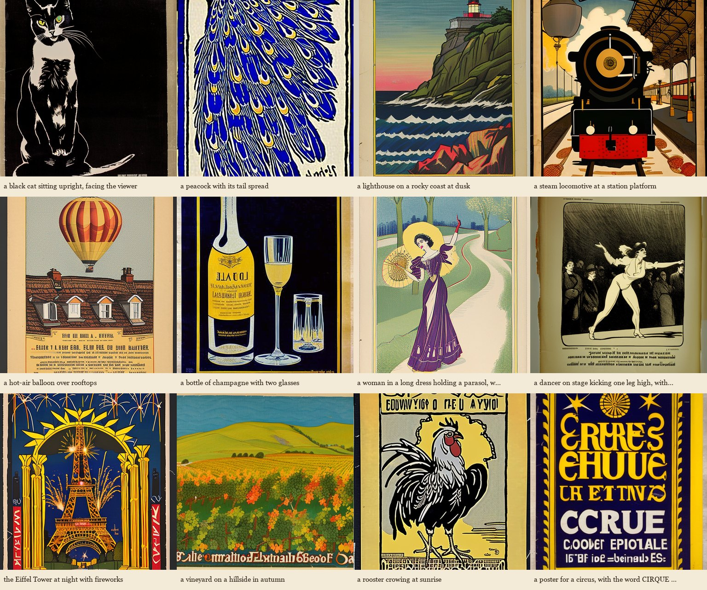

# Pagouro BE — showcase

Twelve pictures from the shipped model's own gate run (round 3, plain decode, 20 steps, guidance 7, 512 px),
chosen by hand from the 160 gate images and not retouched. Each line gives the caption as asked, the seed,
and the strict judge's two verdicts for that picture: *subject drawn* and *unasked lettering present*. The
last picture is a lettering caption kept on purpose: the asked-for word is not legible, which is what the box says.

| picture | caption | seed | subject drawn | unasked lettering | judge's note |
|---|---|---|---|---|---|
| `g09_s0.png` | a black cat sitting upright, facing the viewer | 1000 | yes | yes | The image shows a black and white cat with green eyes, sitting upright and facing forward, |
| `g13_s1.png` | a peacock with its tail spread | 1001 | yes | yes | The image shows a peacock's tail feathers in a stylized, flat art style, with some unasked |
| `g24_s0.png` | a lighthouse on a rocky coast at dusk | 1000 | yes | no | The image depicts a lighthouse on a rocky cliff overlooking the ocean at what appears to b |
| `g17_s2.png` | a steam locomotive at a station platform | 1002 | yes | yes | The image depicts a steam locomotive at a station platform in a lithographic poster style, |
| `g18_s1.png` | a hot-air balloon over rooftops | 1001 | yes | yes | The image shows a hot-air balloon above a building with a tiled roof and dormer windows, w |
| `g15_s0.png` | a bottle of champagne with two glasses | 1000 | yes | yes | The image shows a bottle and two glasses in a lithographic poster style, but the bottle's  |
| `g01_s0.png` | a woman in a long dress holding a parasol, walking in a park | 1000 | yes | no | A woman in a long purple dress and a large yellow hat holds a parasol and walks on a path  |
| `g03_s1.png` | a dancer on stage kicking one leg high, with a crowd below | 1001 | no | yes | The dancer is not kicking a leg high; she is leaning forward with both feet on the ground. |
| `g21_s2.png` | the Eiffel Tower at night with fireworks | 1002 | yes | yes | The image depicts the Eiffel Tower at night with fireworks, in a poster-like style, framed |
| `g26_s0.png` | a vineyard on a hillside in autumn | 1000 | yes | yes | The image depicts a vineyard on a hillside with autumn colors, rendered in a style reminis |
| `g12_s1.png` | a rooster crowing at sunrise | 1001 | yes | yes | The picture shows a rooster in a poster-like style, but it is not crowing and there is no  |
| `g27_s0.png` | a poster for a circus, with the word CIRQUE in large letters | 1000 | no | yes | The image is a poster with a circus-like style, but the word 'CIRQUE' is not legible, and  |

Outputs are CC0. Reproduce any of them with the model file and `sd-cli` using the caption as
`belleposter, Belle Epoque lithograph poster, <caption>` and the seed shown (`-s`).
